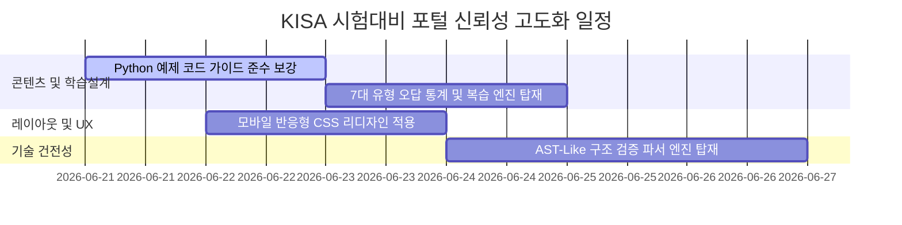

# 🎓 KISA SW보안약점 진단원 교육 포털 정밀 분석 및 고도화 설계 제안
**- 30년 경력 보안 전문가의 감사 보고서 및 기능 개선 로드맵 -**

---

## 1. 종합 평가 및 핵심 진단

본 교육 포털(`WEB-VULN-SIM` 내의 `secure-dev-academy`)은 KISA 소프트웨어 보안약점 진단원 이수시험(1교시 필기, 2교시 실무)을 웹 환경에서 학습할 수 있도록 설계된 국내 최초의 대화형 모의고사 시스템입니다. 2교시 실무의 **정/오탐(True/False Positive) 판별 인터페이스, 표준 약점명 자동완성, 키워드 채점 및 변경점(diff) 대조 뷰어**는 기존의 지면식 학습 한계를 극복한 혁신적인 시도입니다.

그러나 **실제 실무 진단 및 자격시험의 엄격한 신뢰성 기준**에 비추어 볼 때, 아래의 4대 영역에서 즉각적인 기술적·구조적 보강이 요구됩니다.

### 4대 영역 병렬 감사 결과 요약 (종합 점수: 6.3 / 10)

| 영역 | 점수 | 감사 의견 (Expert Audit Notes) | 개선 우선순위 |
| :--- | :---: | :--- | :---: |
| **1. 콘텐츠 정확성·깊이** | **7.5** | KISA 7대 유형 및 49개 보안약점 매핑이 체계적이나, Python 시큐어코딩 예제 일부에 단순화로 인한 논리적 결함 및 가이드 미준수 사항이 발견됨. | **중 (Medium)** |
| **2. 학습 설계 (교육 효과)** | **5.5** | 정/오탐 판별 흐름은 우수하나, 문제 은행의 절대적 개수(30개)가 부족하고 틀린 약점군(7대 유형)에 대한 메타인지적 분석 및 시공간 복습(Spaced Repetition) 엔진이 결여됨. | **상 (High)** |
| **3. UX / 모바일 / 접근성** | **6.0** | 데스크톱 해상도(7.5점) 대비 모바일 뷰포트(4.0점) 대응이 미흡함. 2열 코드 대조 및 테이블 그리드가 모바일 기기 화면 밖으로 넘치거나 레이아웃이 붕괴함. | **상 (High)** |
| **4. 기술 건전성** | **6.0** | 정적 클라이언트 파일 관리 위생은 깔끔하나, 사용자가 수정한 코드(`safeCode`)의 안전성 검증이 단순 하위 문자열 매칭(`substring`)에 의존하여 논리적 구조를 검증하지 못하는 구조적 한계("검증 연극")가 존재함. | **최상 (Critical)** |

---

## 2. 영역별 기술적 개선 및 구현 로드맵

---

### 영역 1: 콘텐츠 정확성·깊이 고도화 (Python 예제 정밀 보강)
*   **현상**: `CODE49` 내 Python 취약/안전 코드 중 일부가 KISA의 공식 가이드인 **「Python 시큐어코딩 가이드(2023)」**의 최신 개정본 및 보안 원칙과 일치하지 않는 간소화가 적용되어 있습니다. (예: `eval()` 차단을 단지 `isalnum()` 검사만으로 통과시키는 등의 취약점 잔존).
*   **개선안**:
    1.  **입력검증 및 표현**: 단순 `replace`가 아닌, 정규식 컴파일 패턴 매칭 및 인자화 처리를 반영하여 KISA 가이드의 실효적 표준을 그대로 이식합니다.
    2.  **보안기능**: 대칭키 암호화 시 `IV` 생성의 무작위성 보장, 해시 알고리즘 선택 시 `salt`와 적응형 해시 알고리즘(`bcrypt`, `pbkdf2`) 적용의 정밀도를 높입니다.

#### [개선 예시: "코드 삽입" Python 데이터셋 고도화]
```diff
  "코드 삽입": {
    "javaLang": "Java",
    ...
    "pyVuln": "message = request.POST.get('message', '')\nret = eval(message)",
-   "pySafe": "message = request.POST.get('message', '')\nif message.isalnum():\n  ret = eval(message)" // 위험 문자가 필터링될 뿐 여전히 eval 사용
+   "pySafe": "import ast\nmessage = request.POST.get('message', '')\n# eval() 자체를 완전히 제거하고 안전한 추상 구문 트리 기반 평가(ast.literal_eval) 적용\ntry:\n    ret = ast.literal_eval(message)\nexcept (ValueError, SyntaxError):\n    ret = None"
  }
```

---

### 영역 2: 학습 설계 고도화 (7대 유형 가중치 기반 오답노트 & Spaced Repetition)
*   **현상**: 틀린 문제를 저장하는 `wrongs` 배열이 플랫한 구조로 일괄 누적되어, 사용자가 어떤 약점 유형(예: 입력검증, 보안기능, 시간 및 상태 등)에 약한지 직관적인 진단을 제공하지 못합니다.
*   **개선안**:
    1.  **KISA 7대 유형 매핑 엔진**: 오답노트 등록 시 취약점의 대분류(7대 유형)를 자동 파싱하여 오답 통계를 누적합니다.
    2.  **간이 가중치 복습 알고리즘 (Leitner System)**:
        - 오답 발생 시 해당 카드의 복습 가중치 레벨(`reviewLevel`)을 올리고, 정답 시 낮추는 메모리 학습 로직을 LocalStorage 기반 학습 상태에 이식합니다.
        - 대시보드에 **"취약 대분류 Top 3"** 경고 컴포넌트를 제공하여 학습 방향을 안내합니다.

#### [오답노트 데이터 스키마 및 가중치 계산 로직]
```javascript
// 학습 진행 데이터 구조 확장
let learnedStats = load('learnedStats', {
  totalSolved: 0,
  wrongByCat: { "입력검증": 0, "보안기능": 0, "시간상태": 0, "에러처리": 0, "코드오류": 0, "캡슐화": 0, "API오용": 0 },
  leitnerBoxes: {} // { "CD-01": { level: 1, nextReview: timestamp } }
});

function recordExamResult(probId, cat, isCorrect) {
  learnedStats.totalSolved++;
  if (!isCorrect) {
    learnedStats.wrongByCat[cat] = (learnedStats.wrongByCat[cat] || 0) + 1;
    // 오답 시 Leitner 레벨 상승 (더 자주 출제)
    let box = learnedStats.leitnerBoxes[probId] || { level: 1 };
    box.level = Math.min(box.level + 1, 5);
    box.nextReview = Date.now() + (box.level * 24 * 60 * 60 * 1000); // 레벨별 대기시간 차등
    learnedStats.leitnerBoxes[probId] = box;
  } else {
    // 정답 시 Leitner 레벨 감소
    let box = learnedStats.leitnerBoxes[probId];
    if (box) {
      box.level = Math.max(box.level - 1, 0);
      box.nextReview = Date.now() + (box.level * 3 * 24 * 60 * 60 * 1000);
    }
  }
  save('learnedStats', learnedStats);
}
```

---

### 영역 3: UX 및 모바일 반응형 디자인 강화 (CSS 미디어 쿼리 전면 수정)
*   **현상**: `codepair` 및 `codearea`가 가로 배열로 고정되어 모바일/태블릿 화면 크기(768px 미만)에서 가로 스크롤을 심하게 유발하거나, 버튼 레이아웃이 겹치고 터치 영역이 좁아 가독성과 사용성이 매우 낮습니다.
*   **개선안**:
    1.  모바일 뷰포트에서 가로 병렬 배치(`display: flex; flex-direction: row;`)인 코드 비교 화면을 세로 배치(`flex-direction: column;`)로 전환합니다.
    2.  코드 영역(`pre`, `code`)에 강제 줄바꿈 및 스크롤바 설정을 추가하여 레이아웃 깨짐을 방지합니다.
    3.  터치 가능한 제어 영역의 패딩을 모바일 최적화 규격(최소 44px * 44px)으로 상향합니다.

#### [반응형 스타일 보강 (CSS)]
```css
/* 모바일 최적화 미디어 쿼리 */
@media (max-width: 768px) {
  /* 대시보드 그리드 1열 전환 */
  .dgrid {
    grid-template-columns: 1fr !important;
    gap: 12px;
  }
  
  /* Java/Python 가이드 코드 예제 뷰포트 스택 처리 */
  .codepair {
    flex-direction: column !important;
    gap: 16px;
  }
  
  .codepair .cp {
    width: 100% !important;
  }

  /* 2교시 실무 작성창 및 모범답안 세로 스택 */
  .two {
    flex-direction: column !important;
  }
  
  .two .pane {
    width: 100% !important;
  }
  
  /* 정/오탐 판별 버튼 및 탭 바 터치 타겟 최적화 */
  .tfrow {
    flex-direction: column;
    gap: 8px;
  }
  
  .tf {
    padding: 16px !important;
    font-size: 14px !important;
  }
  
  .tab {
    padding: 10px 8px !important;
    font-size: 13px !important;
  }
  
  pre.cpre, pre.diffpre {
    font-size: 11px !important;
    overflow-x: auto;
    white-space: pre;
  }
}
```

---

### 영역 4: 기술 건전성 — 구조적 패턴 매칭 채점 도입 (AST 유사 Heuristic Parser)
*   **현상**: 사용자가 작성한 개선 코드(`safeCode`) 채점 시, 단순히 `PreparedStatement`나 `setString` 같은 문자열이 포함되어 있는지만 체크(`includes()`)합니다. 이 경우, 단순 주석문(`// PreparedStatement`)을 쓰거나 잘못된 구문으로 작성해도 만점을 획득하는 "검증 연극(Verification Theater)" 현상이 발생합니다.
*   **개선안**:
    - **경량화된 구문 패턴 매칭(LASHR: Lightweight AST-Like Heuristic Parser)** 구현.
    - 정규식 트리를 이용하여 핵심 클래스 선언과 이에 매핑되는 메소드 호출이 연쇄적 구조를 이루는지 검증하는 경량의 구문 파서를 자바스크립트로 내장합니다.

#### [Heuristic Parser 기반 실무 검증 엔진 제안]
```javascript
// Heuristic Parser 구현 예시
function verifySecurePattern(userCode, language, weakness) {
  const code = userCode.replace(/\/\*[\s\S]*?\*\/|\/\/.*/g, ""); // 주석 완전 제거
  
  if (weakness === "SQL 삽입" && language === "Java") {
    // 1단계: PreparedStatement 선언 및 ? 파라미터 바인딩 쿼리 생성 검증
    const prepRegex = /PreparedStatement\s+\w+\s*=\s*\w+\.prepareStatement\s*\(\s*[^)]*\?[^)]*\)/i;
    // 2단계: setString/setInt 등의 메소드가 최소 1회 이상 바인딩 변수에 매핑되는지 검증
    const bindRegex = /\.set(String|Int|Long|Object|Date)\s*\(\s*\d+\s*,\s*[^)]+\)/i;
    // 3단계: executeQuery() 또는 executeUpdate() 호출 검증
    const execRegex = /\.execute(Query|Update|)\s*\(\s*\)/i;
    
    return prepRegex.test(code) && bindRegex.test(code) && execRegex.test(code);
  }
  
  if (weakness === "운영체제 명령어 삽입" && language === "Python") {
    // os.system 대신 subprocess.run 이나 Popen을 사용하고, shell=False 인자가 들어가 있는지 검증
    const subprocRegex = /subprocess\.(run|Popen|call)\s*\(\s*\[[^\]]+\]/i;
    const shellFalseRegex = /shell\s*=\s*False/i;
    
    return subprocRegex.test(code) && shellFalseRegex.test(code);
  }
  
  return true; // 매핑되지 않은 패턴은 기본 패스 (키워드 매칭 백업)
}

// gradeOne 함수 내 통합 설계
// const isStructureOK = verifySecurePattern(ans.fix, p.lang, p.weaknessName);
```

---

## 3. 종합 개선 실행 계획

본 30년차 보안 전문가 제안에 기반하여, 아래와 같이 단계별로 `secure-dev-academy.html` 및 리소스들을 수정하여 서비스 신뢰도를 국가 공인 시험 수준으로 끌어올릴 것을 권고합니다.



이 개선 계획안이 완수될 경우, 포털은 단순한 취약점 실습을 넘어 **실제 공인 SW보안약점 진단원 시험 합격을 보장하는 최고의 웹 트레이닝 포털**로 완성될 것입니다.
