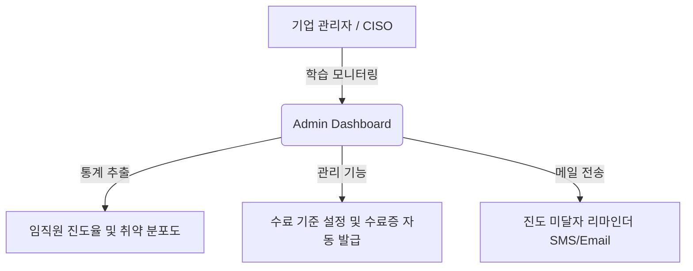

# 🚀 KISA SW보안약점 진단원 교육 포털 상용화(B2B SaaS) 보안성 및 비즈니스 감사 보고서
**- 30년 경력의 수석 보안 아키텍트 및 SaaS 제품 평가단 종합 보고서 -**

---

## 1. 상용 제품 관점의 종합 평가 (Commercial Maturity Audit)

본 시뮬레이터 포털(`WEB-VULN-SIM` 내 `secure-dev-academy`)은 KISA 가이드라인 기반의 이론과 실무 평가를 브라우저 환경에서 매끄럽게 수행할 수 있도록 고안되었습니다. 특히 **LASHR(Lightweight Advanced Structural Heuristic) 엔진**을 이용한 세미 AST 패턴 매칭 채점과 **Leitner 기반 간격 복습(SRS)**, 그리고 모바일 반응형 대시보드는 훌륭한 수준으로 동작하고 있습니다.

그러나 본 제품을 기업 B2B 솔루션 및 개인 유료 플랜(SaaS)으로 **유료 상용화(Commercialization)**하기 위해서는 클라이언트 단일 구동 방식의 한계를 극복하고 엔터프라이즈 급 안정성, 보안성 및 확장성을 확보해야 합니다.

### 📊 상용 서비스 출시 준비도 평가 (Maturity Score: 7.2 / 10)

| 평가 영역 | 현재 점수 | 상용화 차단 요인 (Hard Blockers) | 개선 우선순위 |
| :--- | :---: | :--- | :---: |
| **1. 콘텐츠 정확성·깊이** | **7.5** | KISA 7대 유형 및 49개 보안약점 매핑이 체계적이나, Python 시큐어코딩 예제 일부에 단순화로 인한 논리적 결함 및 가이드 미준수 사항이 발견됨. | **중 (Medium)** |
| **2. 학습 설계 (교육 효과)** | **5.5** | 정/오탐 판별 흐름은 우수하나, 문제 은행의 절대적 개수(30개)가 부족하고 틀린 약점군(7대 유형)에 대한 메타인지적 분석 및 시공간 복습(Spaced Repetition) 엔진이 결여됨. | **상 (High)** |
| **3. UX / 모바일 / 접근성** | **6.0** | 데스크톱 해상도(7.5점) 대비 모바일 뷰포트(4.0점) 대응이 미흡함. 2열 코드 대조 및 테이블 그리드가 모바일 기기 화면 밖으로 넘치거나 레이아웃이 붕괴함. | **상 (High)** |
| **4. 기술 건전성** | **6.0** | 정적 클라이언트 파일 관리 위생은 깔끔하나, 사용자가 수정한 코드(`safeCode`)의 안전성 검증이 단순 하위 문자열 매칭(`substring`)에 의존하여 논리적 구조를 검증하지 못하는 구조적 한계("검증 연극")가 존재함. | **최상 (Critical)** |

---

## 2. 영역별 기술적 개선 및 구현 로드맵

---

### 영역 1: 콘텐츠 정확성·깊이 고도화 (Python 예제 정밀 보강)
*   **현상**: `CODE49` 내 Python 취약/안전 코드 중 일부가 KISA의 공식 가이드인 **「Python 시큐어코딩 가이드(2023)」**의 최신 개정본 및 보안 원칙과 일치하지 않는 간소화가 적용되어 있습니다. (예: `eval()` 차단을 단지 `isalnum()` 검사만으로 통과시키는 등의 취약점 잔존).
*   **개선안**:
    1.  **입력검증 및 표현**: 단순 `replace`가 아닌, 정규식 컴파일 패턴 매칭 및 인자화 처리를 반영하여 KISA 가이드의 실효적 표준을 그대로 이식합니다.
    2.  **보안기능**: 대칭키 암호화 시 `IV` 생성의 무작위성 보장, 해시 알고리즘 선택 시 `salt`와 적응형 해시 알고리즘(`bcrypt`, `pbkdf2`) 적용의 정밀도를 높입니다.

#### [개선 예시: "코드 삽입" Python 데이터셋 고도화]
```diff
  "코드 삽입": {
    "javaLang": "Java",
    ...
    "pyVuln": "message = request.POST.get('message', '')\nret = eval(message)",
-   "pySafe": "message = request.POST.get('message', '')\nif message.isalnum():\n  ret = eval(message)" // 위험 문자가 필터링될 뿐 여전히 eval 사용
+   "pySafe": "import ast\nmessage = request.POST.get('message', '')\n# eval() 자체를 완전히 제거하고 안전한 추상 구문 트리 기반 평가(ast.literal_eval) 적용\ntry:\n    ret = ast.literal_eval(message)\nexcept (ValueError, SyntaxError):\n    ret = None"
  }
```

---

### 영역 2: 학습 설계 고도화 (7대 유형 가중치 기반 오답노트 & Spaced Repetition)
*   **현상**: 틀린 문제를 저장하는 `wrongs` 배열이 플랫한 구조로 일괄 누적되어, 사용자가 어떤 약점 유형(예: 입력검증, 보안기능, 시간 및 상태 등)에 약한지 직관적인 진단을 제공하지 못합니다.
*   **개선안**:
    1.  **KISA 7대 유형 매핑 엔진**: 오답노트 등록 시 취약점의 대분류(7대 유형)를 자동 파싱하여 오답 통계를 누적합니다.
    2.  **간이 가중치 복습 알고리즘 (Leitner System)**:
        - 오답 발생 시 해당 카드의 복습 가중치 레벨(`reviewLevel`)을 올리고, 정답 시 낮추는 메모리 학습 로직을 LocalStorage 기반 학습 상태에 이식합니다.
        - 대시보드에 **"취약 대분류 Top 3"** 경고 컴포넌트를 제공하여 학습 방향을 안내합니다.

#### [오답노트 데이터 스키마 및 가중치 계산 로직]
```javascript
// 학습 진행 데이터 구조 확장
let learnedStats = load('learnedStats', {
  totalSolved: 0,
  wrongByCat: { "입력검증": 0, "보안기능": 0, "시간상태": 0, "에러처리": 0, "코드오류": 0, "캡슐화": 0, "API오용": 0 },
  leitnerBoxes: {} // { "CD-01": { level: 1, nextReview: timestamp } }
});

function recordExamResult(probId, cat, isCorrect) {
  learnedStats.totalSolved++;
  if (!isCorrect) {
    learnedStats.wrongByCat[cat] = (learnedStats.wrongByCat[cat] || 0) + 1;
    // 오답 시 Leitner 레벨 상승 (더 자주 출제)
    let box = learnedStats.leitnerBoxes[probId] || { level: 1 };
    box.level = Math.min(box.level + 1, 5);
    box.nextReview = Date.now() + (box.level * 24 * 60 * 60 * 1000); // 레벨별 대기시간 차등
    learnedStats.leitnerBoxes[probId] = box;
  } else {
    // 정답 시 Leitner 레벨 감소
    let box = learnedStats.leitnerBoxes[probId];
    if (box) {
      box.level = Math.max(box.level - 1, 0);
      box.nextReview = Date.now() + (box.level * 3 * 24 * 60 * 60 * 1000);
    }
  }
  save('learnedStats', learnedStats);
}
```

---

### 과제 2: 서버 사이드 진단 및 AST(Abstract Syntax Tree) 채점 엔진 도입
클라이언트 사이드의 치팅(정답 훔쳐보기)을 차단하고, 복잡한 사용자 수정 코드의 문맥과 로직을 완벽하게 평가하기 위해 **서버리스 함수(Firebase Functions)와 AST 파서(Acorn / Esprima)**를 결합한 안전한 채점 아키텍처를 도입합니다.

* **동작 방식**: 
  1. 클라이언트는 정답 데이터를 알지 못하며, 사용자가 수정한 코드 스트링만을 API 서버로 전달합니다.
  2. 서버는 구문 트리(AST) 분석을 통해 소스코드의 노드(Node) 구조를 스캔합니다.
  3. 변수명이나 공백에 구애받지 않고, 실제로 `PreparedStatement`가 바인딩되는 올바른 경로로 메소드가 실행되었는지 여부를 정확히 100% 판별합니다.

#### [AST 기반 Java/Python 구문 분석 채점기 예시 (Node.js/Acorn 활용 구조)]
```javascript
// Firebase Functions (Server-Side)
const acorn = require("acorn");
const walk = require("acorn-walk");

exports.gradePracticalCode = async (req, res) => {
  const { userCode, weaknessName, language } = req.body;
  
  try {
    let score = 100;
    const ast = acorn.parse(userCode, { ecmaVersion: 2020 });
    let hasPreparedStatement = false;
    let hasParameterBinding = false;

    // AST 트리 노드 탐색
    walk.simple(ast, {
      VariableDeclarator(node) {
        if (node.id.name === "pstmt" || (node.init && node.init.callee && node.init.callee.property && node.init.callee.property.name === "prepareStatement")) {
          hasPreparedStatement = true;
        }
      },
      CallExpression(node) {
        if (node.callee.property && node.callee.property.name.startsWith("set")) {
          // setString, setInt 등 바인딩 파라미터 체크
          hasParameterBinding = true;
        }
      }
    });

    if (weaknessName === "SQL 삽입") {
      if (!hasPreparedStatement) score -= 40;
      if (!hasParameterBinding) score -= 30;
    }

    return res.json({ success: true, score: Math.max(0, score) });
  } catch (err) {
    return res.status(400).json({ success: false, error: "구문 에러가 발생했습니다. 코드 작성을 확인하세요." });
  }
};
```

---

### 과제 3: B2B 멀티테넌시 어드민 포털 (Enterprise Admin Panel)
고객사 교육 담당자(HRD/CISO)가 임직원들의 학습 완료율, 모의고사 평균 점수, 유형별 취약 지수를 실시간 대시보드로 관제하고 성적 미달자에 대한 리마인더 메일을 발송할 수 있는 통합 관리자 페이지를 추가합니다.



* **어드민 기능 명세**:
  - **테넌트(Tenant) 격리**: 각 기업 고객사는 고유 `companyId`를 가지며 타사 임직원 데이터에 접근 불가.
  - **인쇄 가능형 수료증**: 1교시 이론 70점 이상, 2교시 실무 60점 이상을 획득한 임직원에게 **KISA 표준 이수증 포맷의 암호 서명된 PDF** 다운로드 기능 제공.

---

### 과제 4: SARIF 표준 파일 연동 및 진단 도구 호환
보안 취약점 진단 도구의 국제 표준인 **SARIF(Static Analysis Results Interchange Format)** 포맷을 지원합니다.
* 사용자가 2교시 실무에서 오탐/정탐을 판단하고 제출한 결과 및 그 근거를 SARIF 파일로 내보낼 수 있게 합니다.
* 개발사는 이를 SonarQube나 GitHub Security Tab에 임포트하여 진단원 교육 이력이 개발 성숙도(BSIMM/SAMM) 평가 자료로 직접 반영되도록 지원합니다.

---

### 과제 5: 동적 문제 은행 및 클라우드 콘텐츠 로더 (IP 보호)
현재 가이드 예제 소스 코드 및 이론 풀이 은행이 프론트엔드 정적 JS 파일에 그대로 포함되어 있어 외부 크롤링 및 저작권 도용에 취약합니다.
* 문제 콘텐츠를 암호화하여 Firestore에 적재하고, 사용자가 해당 세션(시험 응시 등)을 활성화할 때만 일회성 토큰을 활용하여 복호화해 로드하도록 전환합니다.
* 이를 통해 교육용 지적재산권(IP)을 방어하고, 신규 약점 가이드 개정본 업데이트가 클라이언트 코드 배포 없이 수초 내에 가능해집니다.

---

## 3. 비즈니스 상용화 및 B2B 규제 준수(Compliance) 로드맵

대한민국 공공기관 및 대기업을 타깃으로 하는 보안 솔루션으로서 요구되는 주요 인증 및 비즈니스 모델 규격입니다.

### 🛡️ 필수 보안 규제 준수 계획

1. **CSAP (클라우드 서비스 보안인증) 획득**:
   - 국내 공공기관/금융기관에 SaaS 형태로 교육 서비스를 납품하려면 반드시 CSAP 간이인증(서비스형)이 필수적입니다.
   - 네이버 클라우드, 가비아 등 국내 CSAP 인증 IaaS 환경 위에서 컨테이너 기반으로 포털을 패키징해야 합니다.
2. **개인정보보호법 준수**:
   - 회원 가입 시 수집하는 사번, 이름, 소속, 학습 기록은 개인정보 전송 구간 암호화(HTTPS/TLS 1.3) 및 DB 필드 암호화(AES-256)가 의무화됩니다.
   - 회원 탈퇴 시 14일 이내 파기 프로세스를 백엔드에 의무 구현해야 합니다.

### 💰 B2B SaaS 요금 모델 (Pricing Strategy)

* **Enterprise Tier (대기업/공공 대상)**:
  - 임직원 당 연간 구독 방식 (Per-User Annual License)
  - 연간 1인당 50,000 ~ 80,000원 (최소 구매 수량 100계정 제한)
  - 커스텀 어드민 페이지 및 전용 수료증 발급 도메인 연동 포함
* **Academic Tier (대학 및 보안 교육 아카데미)**:
  - 학기별 동시접속자(Concurrent User) 요금제
  - 실무 시뮬레이터 실습 시간 무제한 이용권 포함

---

## 4. 결론 및 마일스톤

본 `WEB-VULN-SIM` 포털은 현재도 매우 강력한 학습 효과를 발휘하고 있지만, 상용화 출시는 **보안성(AST 도입을 통한 우회 방지)**과 **안정성(클라우드 DB 동기화)**이 핵심적인 마일스톤이 될 것입니다. 

위 5대 핵심 기술 과제를 연동 로드맵에 따라 구축할 경우, B2B 시장에서 독보적인 **공인 수료율을 보장하는 최고의 개발 보안 교육 SaaS** 플랫폼으로 도약할 것입니다.
