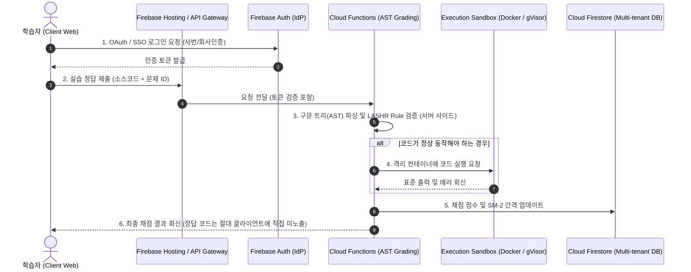

# 🚀 KISA SW보안약점 진단원 학습 포털 상용화(B2B SaaS) 보안성 및 비즈니스 감사 보고서
**- 현재 구현 수준 진단 및 엔터프라이즈 SaaS 출시를 위한 격차 분석(Gap Analysis) & 아키텍처 설계 -**

---

## 1. 개요 (Executive Summary)

본 보고서는 `WEB-VULN-SIM` 포털 내 `secure-dev-academy` 애플리케이션의 **현재 로컬 구현 수준**을 검토하고, 이를 기업용 B2B SaaS 및 유료 교육 서비스로 상용화하기 위해 요구되는 **보안성, 신뢰성, 확장성 측면의 격차(Gap)**를 30년 경력의 수석 보안 아키텍트 관점에서 진단합니다.

현재 구현된 시스템은 클라이언트 사이드 AST(Tree-sitter) 기반 주석 제거, LASHR Heuristic 구조 검증, SM-2 간격 반복 알고리즘, 반응형 대시보드, WCAG 접근성 및 Piston/Pyodide 기반 코드 실행 등 교육적 완성도가 매우 높습니다. 그러나 실제 **B2B SaaS 시장의 상용 도구**로 안착하기 위해서는 클라이언트 단독 실행 구조가 지닌 근본적인 우회 가능성과 지적재산권(IP) 노출 문제를 해결해야 합니다.

---

## 2. 핵심 모듈별 현 구현 vs 상용 SaaS 비교 (Gap Analysis)

| 평가 영역 | 현재 로컬 구현 수준 (Current) | 실제 상용 B2B SaaS 표준 (Commercial Standard) | 보안 및 비즈니스 취약점 (Gaps & Risks) |
| :--- | :--- | :--- | :--- |
| **채점 신뢰성 & 부정 방지** | **클라이언트 사이드 AST + LASHR**<br>- 브라우저 내에서 Tree-sitter와 Regex 검증 수행 | **서버 사이드 격리형 AST 분석 엔진**<br>- 클라이언트는 소스코드만 제출하고 서버에서 구문 분석 후 결과 반환 | **F12 우회 취약성 (Critical)**<br>- 개발자 도구를 열어 JS 변수 조작 또는 채점 함수 우회 시 100% 점수 획득 가능 |
| **코드 실행 안전성** | **Pyodide(WASM) 및 외부 Piston API**<br>- Python은 브라우저 내 WASM 실행<br>- C/Java는 무료 외부 Piston/Wandbox API 호출 | **샌드박스 가상 컨테이너 실행 환경**<br>- AWS ECS/EKS 또는 GCP Cloud Run 기반의 일회성 격리 컨테이너 구동 | **기업 기밀/IP 유출 및 실행 한계 (High)**<br>- 임직원 실습 코드가 무료 외부 API 서버로 전송되어 IP 유출 위험 존재<br>- Pyodide는 대규모 라이브러리 실행 불가 |
| **진도 데이터 영속성** | **LocalStorage (SM-2 알고리즘)**<br>- 로컬 브라우저 캐시에 SM-2 변수(`ef`, `rep`, `interval`) 저장 | **실시간 동기화 Cloud DB (Firestore/RDS)**<br>- 사용자 UID별 진도, 오답 복습 주기 기록 및 오프라인-온라인 싱크 | **데이터 소실 및 이력 변조 (High)**<br>- 브라우저 캐시 삭제 시 모든 오답 및 학습 이력 소실<br>- LocalStorage 인위적 조작으로 이수 기준 위조 가능 |
| **콘텐츠 & IP 보호** | **JS 파일 내 평문 하드코딩**<br>- 132개 이론 문항, 78개 실무 문항이 `specs_*.py`를 통해 HTML에 평문 적립 | **세션 기반 온디맨드 암호화 스트리밍**<br>- 권한이 검증된 토큰 소유자에게만 해당 문제와 예제 코드를 암호화하여 로드 | **지적재산권(IP) 노출 (Medium)**<br>- 크롤링이나 소스코드 다운로드를 통해 전체 문제 은행 및 모범답안 유출 용이 |
| **B2B 관리 및 이수증** | **로컬 게이미피케이션 & 이력 표시**<br>- HTML 내 인쇄 기능 및 로컬 대시보드 | **멀티테넌시 관리자 포털 & PKI 이수증**<br>- CISO용 진도율 모니터링, LTI 1.3 LMS 연동, 전자서명(PKI) 수료증 발급 | **통합 관제 및 신뢰성 부재 (Medium)**<br>- 기업 교육 담당자가 사원의 진도를 일괄 파악할 수 없음<br>- 암호 서명 없는 수료증은 위조 가능 |

---

## 3. 상용화 기술 아키텍처 블루프린트 (Target Architecture)

상용 B2B SaaS 모델로 전환하기 위해 제안하는 아키텍처는 **Firebase Cloud Functions (Node.js)** 및 **격리된 코드 실행 샌드박스**를 활용한 서버리스 마이크로서비스 구조입니다.

### 3.1 개념적 데이터 흐름도



### 3.2 데이터베이스 스키마 표준 설계 (Cloud Firestore 기준)

#### 1) `/companies/{companyId}` (기업 테넌트 문서)
```json
{
  "name": "주식회사 한국보안",
  "domain": "korea-security.com",
  "license": {
    "tier": "Enterprise",
    "activeUsersLimit": 500,
    "expiresAt": 1782211200000
  },
  "settings": {
    "certPassScore": 70,
    "allowIPRanges": ["210.123.45.0/24"]
  }
}
```

#### 2) `/users/{uid}/progress/summary` (사용자 진도 및 통계)
```json
{
  "email": "employee@korea-security.com",
  "companyId": "comp-korea-sec-01",
  "stats": {
    "examBest": 85,
    "pracBest": 72,
    "level": 5,
    "xp": 3450,
    "learnedCount": 49
  },
  "completedModules": {
    "basics": true,
    "exam": true,
    "prac": false
  }
}
```

#### 3) `/users/{uid}/wrongs/{wrongId}` (SM-2 기반 오답 스케줄러)
```json
{
  "questionId": "CD-01",
  "category": "입력검증",
  "box": 3,
  "ef": 2.62,
  "rep": 2,
  "interval": 6,
  "due": 1782297600000,
  "addedAt": 1782038400000
}
```

#### 4) `/certificates/{certId}` (전자서명된 수료증 검증)
```json
{
  "uid": "usr_9f81a2bc",
  "userName": "이철수",
  "companyName": "주식회사 한국보안",
  "courseName": "SW보안약점 진단원 대비 과정",
  "issuedAt": 1782038400000,
  "score": 82.5,
  "signature": "hmac_sha256(uid + issuedAt + score, Server_Secret_Key)"
}
```

---

## 4. 규제 준수 및 컴플라이언스 로드맵 (Regulatory Compliance)

대한민국 공공기관 및 대기업을 타깃으로 하는 보안 교육 솔루션으로 공인받기 위한 법적/기술적 필수 요건입니다.

```
┌─────────────────────────────────────────────────────────────────────────┐
│              [대한민국 공공/금융 조달 및 B2B SaaS 필수 규제]            │
├───────────────────────────────────┬─────────────────────────────────────┤
│ 1. CSAP SaaS 간이인증 (공공 조달)  │ 2. 개인정보보호법 (DB 및 통신 암호화)│
│    - 국내 CSAP IaaS 인프라 사용   │    - 고유식별정보 AES-256 저장      │
│    - 논리적 망 분리 및 암호 모듈  │    - TLS 1.3 강제, 탈퇴 시 14일 파기│
├───────────────────────────────────┴─────────────────────────────────────┤
│ 3. ISMS-P (정보보호 관리체계) 준수                                     │
│    - 사용자 세션 30분 만료, 접근 통제 및 2차 인증(MFA) 구현              │
└─────────────────────────────────────────────────────────────────────────┘
```

1. **CSAP (클라우드 서비스 보안인증) SaaS 간이인증**:
   - 행정·공공기관 납품을 위한 필수 관문입니다.
   - **조치 요건**: 네이버 클라우드 플랫폼(NCP) 등 CSAP 인증을 획득한 IaaS 환경에 시스템을 구축해야 하며, 공인 검증된 국가정보원 검증필 암호모듈(KCMVP)을 전송(SSL/TLS) 및 저장(DB) 구간에 사용해야 합니다.
2. **개인정보보호법 준수**:
   - 교육생들의 평가 점수, 사번, 이메일 등의 개인정보 유출 방지 조치가 필요합니다.
   - **조치 요건**: DB 저장 시 개인정보 필드 AES-256 암호화, 모든 API 호출 구간 TLS 1.3 강제 적용, 회원 탈퇴 시 14일 이내 복구 불가능한 영구 파기 로직 수립.
3. **ISMS-P 인증 연계**:
   - 대기업 B2B 고객사의 사내 시스템 통합 요건으로 자주 요청됩니다.
   - **조치 요건**: 어드민 페이지 접근 시 OTP/MFA 2차 인증 의무화, 세션 자동 만료(30분), 개인정보 다운로드 시 CISO 사전 승인 워크플로우 구현.

---

## 5. 비즈니스 BM 및 요금 정책 (Business & Pricing Model)

B2B SaaS 제품의 조기 안착을 위한 세부 요금 구조와 기업용 특화 정책입니다.

### 5.1 요금제 체계
* **Academic Tier (대학 및 국비지원 아카데미)**:
  - 동시접속자수(CCU) 기준 과금 (예: 50 CCU - 월 200,000원)
  - 웹 기반 Pyodide(Python) 실습 환경만 제공 (C/Java 샌드박스 비활성화)
* **Standard Tier (일반 기업 직무 교육)**:
  - 연간 사용자당 라이선스 (Per-User Annual License)
  - 1인당 연간 60,000원 (최소 구매 수량 30계정)
  - Firebase DB 기반 영구 보존 오답노트 및 대시보드 조회
* **Enterprise Tier (대기업, 금융, 공공기관)**:
  - 연간 구독형 테넌트 라이선스 + 전용 호스팅
  - 1인당 연간 90,000원 (사내 SSO 연동, LTI 1.3 LMS 연동 기술 지원)
  - 기업 보안 담당자용 원클릭 수료율 보고서, 서명된 PDF 이수증 검증기 제공

### 5.2 암호화 이수증 검증기 구현 (수료증 위조 차단)
학습자가 임의로 HTML/CSS를 수정하여 인쇄하는 수료증 위조를 막기 위해, 서버에서 발행한 고유 키값 기반의 **QR 코드/HMAC 서명 검증 모델**을 적용합니다. 
기업 담당자는 발급된 수료증의 URL(`https://vuln-sim.web.app/verify?cert=ID`)을 입력하여 서버 DB의 발행 이력 및 HMAC 해시 일치 여부를 대조해 1초 만에 위조 여부를 판별할 수 있습니다.

---

## [부록] 현재 로컬 아키텍처 및 구현 명세 (Local Architecture Specification)

> *주의: 아래 내용은 백엔드 마이그레이션 전, Firebase Hosting(Spark 무료 플랜) 환경에서 동작하도록 고안된 현재 정적 클라이언트 아키텍처 스펙입니다.*

### 1) 배포 및 진입 구조
* **호스팅**: **https://vuln-sim.web.app** (Spark 무료 플랜)
  - `public/` 디렉터리 내 정적 리소스만 업로드되며, `books/` 원문 PDF 및 `_gen/` 빌더 코드는 배포에서 제외되어 저작권 및 소스 코드를 1차 보호합니다.
* **진입**: `index.html` (스플래시) &rarr; `secure-dev-academy.html` (학습 센터)

### 2) 클라이언트 사이드 검증 엔진 (LASHR & AST)
* **주석 제거**: Monaco Editor 인스턴스에서 코드를 추출한 뒤, `tree-sitter-c`/`java`/`python` WASM 파서를 로드하여 구문 분석을 진행하고 주석 노드를 제거하여 공백 및 주석 변경을 통한 우회를 원천 차단합니다. 로딩 실패 시 정규식(Regex) 기반 백업 필터로 폴백됩니다.
* **구조 검사**: `LASHR` 구조 매핑 룰에 따라 취약점별 필수 메소드 및 패턴을 대조합니다.

### 3) 2026 이수시험 정합성
* **1교시**: 30문항 전면 객관식 프리셋 (60분 시간제한 및 실제 OMR 레이아웃).
* **2교시**: 15문항 서술형 및 복합설계 진단 보고서 작성 (100분 시간제한).
* **설계 진단**: 12개 복합 시나리오별 진단보고서(분류·정/오탐·개선안) 작성 및 키워드 기반 채점.

---

## 9. 최근 작업 현황 (2026-06 갱신)

> 본 절은 보고서 본문(상용화 격차 분석)과 별개로, 콘텐츠·기능 강화 작업의 **진행 상태**를 기록한다.

### 1) C/C++ 코딩 표준 레퍼런스 (`public/coding-standards.html`)
* `_gen/gen_standards.py` 가 단일 HTML로 생성. 규칙 데이터는 표준별 모듈(`std_misrac`·`std_misracpp`·`std_certc`·`std_certcpp`·`std_autosar`)의 파트 파일(`std_<key>_pN.py`) 병합. **5대 표준 총 562룰**(MISRA C:2012 127 · MISRA C++:2023 94 · CERT C 137 · CERT C++ 83 · AUTOSAR C++14 121).
* UI: 좌측 고정 사이드바 트리 네비게이션 + 표준내 검색 + 위반↔준수 코드 토글 + **전역 KO/EN 토글** + 각 카드 "🧪 IDE에서 연습"(Monaco → Wandbox 원격 컴파일·실행, C=`gcc-13.2.0-c`, C++=`gcc-13.2.0`).
* **규칙 강화 작업(5대 표준 562룰 전수 완료)** — 각 룰을 *풍부한 컴파일 가능 예제(int main 포함) + 근거·영향·대응 3요소 심화 해설 + 한/영 이중언어(`title_en`/`why_en`)* 로 재작성. Wandbox(`-std=gnu11 -lm -pthread` / `-std=gnu++17 -pthread`)로 전수 **컴파일+실행** 검증(`_gen/_compile_verify.py`). 동시성/시그널/종료/longjmp 등 데드락·무한대기·강제종료 위험 경로는 런타임 미도달 가드로 검증 안전성 확보. 단일 TU 불가·ill-formed·언어연결·C++17 제거 API(auto_ptr) 등 본질적으로 단독 컴파일 불가한 소수 룰만 `compiles` 미표시 초점 스니펫 유지. 다중 번역단위·전처리 토큰결합 등 단일 파일로 성립 불가한 소수 룰만 `compiles` 미표시 초점 스니펫 유지.

| 표준 | 룰 수 | 강화 상태 |
| :-- | :-- | :-- |
| MISRA C:2012 | 127 | ✅ 완료 (p1 44·p2 42·p3 41) |
| MISRA C++:2023 | 94 | ✅ 완료 (p1 25·p2 46·p3 23) |
| CERT C | 137 | ✅ 완료 (p1 39·p2 27·p3 31·p4 40) |
| CERT C++ | 83 | ✅ 완료 (p1 25·p2 19·p3 23·p4 16) |
| AUTOSAR C++14 | 121 | ✅ 완료 (p1 44·p2 39·p3 38) |

* **CERT C/C++ ID 정확성**: `cmu-sei.github.io` 공식 목록 대조 완료(오류 0). 재생성: `cd _gen && PYTHONIOENCODING=utf-8 python gen_standards.py`.
* 주의: 코드 필드는 raw 삼중따옴표 `r"""..."""`(끝에 `"`/백슬래시 금지), `why`/`title`/`*_en` 은 일반 문자열이라 백슬래시 이스케이프 주의. `_compile_verify.lang_of` 는 길이 내림차순 매칭(`misrac`가 `misracpp` 접두사로 오인되지 않도록).

### 2) 아카데미 개념 강화
* **진단 의사결정 흐름**(`_gen/specs_trees.py`): 49개 보안약점별 진단 게이트(안전→위험)를 자체 재구성해 📖 개념 학습 카드에 주입. `gen_academy.py` 가 약점명으로 join.
* **📐 설계 진단 12 → 18 시나리오 확장**(`_gen/_design.py`): LDAP 조회·OS 명령·HTTP 응답헤더·반복 인증제한·코드 다운로드 무결성(오탐 사례)·암호키 관리 추가.

### 3) 저작권 자료 정리
* `books/` 를 `.gitignore` 에 추가하고 추적 중이던 저작권 PDF·추출 텍스트를 git 추적에서 제거. (참고용 추출 텍스트는 `books/_extract/` — 배포·커밋 제외.)
