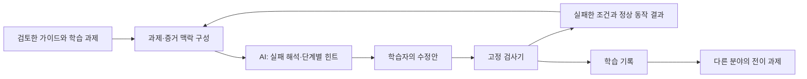

# WEB-VULN-SIM — 원티드 AI Championship 대상 도전 재분석·GLM 실행 명세

작성·공식 자료 확인: 2026-09-14  
분석 대상: `C:\firebaseprojects\web-vuln-sim` / 로컬 HEAD `93a1e96` 및 미커밋 상태  
목적: **KISA와 분야별 전문 자료를 연결하는 통합 보안 교육 포털을, AI 경진대회에서 설득력 있게 작동·검증·시연할 수 있는 작품으로 완성한다.**

## 1. 이번 판단

지금 가장 필요한 것은 콘텐츠의 추가 물량보다 **현재 자산을 하나의 학습 경험으로 연결하고 AI의 기여를 증명하는 작업**이다. 이미 금융·자동차·웹·시스템·네트워크·OT·AI·개인정보 콘텐츠와 실습 도구가 상당히 있다. 최근에는 산업별 홈, AI 학습 경로, 가드레일 연습, 오개념 복습까지 추가됐다.

그러나 “모든 보안을 알려주는 539개 페이지”만으로는 문제 해결력·AI 기술력·발표 전달력을 충분히 설명하기 어렵다. 권장 출품 메시지는 다음과 같다.

> **보안 가이드를 읽어도 실전에서 무엇을 고쳐야 할지 막히는 개인을 위해, 실패한 실습 증거에 맞춰 AI가 다음 행동을 안내하고 다른 산업의 문제까지 다시 풀게 하는 보안 교육 포털.**

전체 분야를 포괄하는 제품 방향은 유지한다. 대표 시연은 기존 **차량 데이터 접근 사고**에 집중하고, 같은 인가 원리를 금융·산업 현장에 적용하는 짧은 전이 과제로 확장성을 보여준다. 개인정보는 이 사건의 영향 범위 판단이자 독립 학습 분야다.

대상 가능성을 수치로 산정할 근거는 없다. 아래 평가는 공개 심사 항목에 맞춘 제품·기술 판단이며 심사위원의 의중이나 수상 예측이 아니다.

### 이전 문서와의 관계

- 이 문서가 **대회 제출 우선순위와 전체 포털 방향의 최신 기준**이다.
- [9월 13일 재평가](SECURITY_PLATFORM_REASSESSMENT_GLM_2026-09-13.md)는 과거 상태와 상세 설계 참고다. 이미 반영된 기능을 다시 신규 개발하지 않는다.
- [구독·한국 개인정보 확장안](B2C_SUBSCRIPTION_UI_KOREA_PRIVACY_PLAN_2026-09-13.md)은 개인정보 하위 트랙과 구독 운영 아이디어로만 사용한다. 전체 제품을 개인정보 서비스로 축소하지 않는다. 그 문서의 결함 목록은 당시 관찰이며 현재 상태와 다르다.

## 2. 실제 대회 조건과 개발 일정

[Wanted AI Championship 2026 공식 안내·FAQ][W01]에서 확인한 내용이다.

| 항목 | 공식 안내 |
|---|---|
| 참가 접수 | 9월 18일 23:59:59 마감 |
| 과제 제출 | 9월 20일 23:59:59 마감 |
| 예선 | 내부 심사 80% + 투표 20%; 기획력·실현 가능성·확장성·AI 활용 적절성 |
| 본선 | 심사위원 100%; 기획력·확장성·기술력·발표 전달력 |
| TOP20 / Demo Day | 10월 7일 / 10월 17일 |
| 제출 | 작동하는 배포 URL, 해결 문제, AI 활용 방식·사용 도구 |
| 기존 프로젝트 | 제출 가능. 운영 중 서비스는 운영 기간·수익화 여부 별도 안내 필요 |
| 제출 후 | 마감 후 과제 수정 불가. 심사 중 서비스 접속 가능해야 함 |

세부 항목별 배점과 본선 발표 시간은 공개 안내에서 확인되지 않았다. 여기의 3분 시연·5분 발표는 준비용 제안이다. 제출 뒤 배포 코드 변경의 허용 범위는 FAQ의 ‘과제 수정’ 문구만으로 확정하지 않는다. 제출 빌드를 보존하고 후속 버전은 분리한다. [공식 FAQ][W01]

**실행 판단:** 9월 14~20일은 대표 실습·AI 증거 전달·홈 진입·평가 자료에 집중한다. 전체 페이지 재작성, 결제 기능, 거대한 신규 도메인 제작은 제출 이후 계획으로 둔다. 접수 여부는 이번 조사로 확인하지 못했다.

## 3. 현재 상태: 무엇이 이미 달라졌나

### 3.1 직접 재확인한 구현

| 자산 | 9월 14일 관찰 | 대회에서의 쓰임 |
|---|---|---|
| 콘텐츠 | `public` HTML 539개. 학습 외 유틸리티 포함 | 보유 자산 규모. 실습 539개라고 표현하지 않음 |
| 검색 / 학습 카탈로그 | 검색 536개, 공통·진도 카탈로그 각각 491개 | 탐색·진도 기반이 이미 있음 |
| 별도 집계 | `build-meta.json`의 `catalogTotal`은 494 | 집계 모집단이 다름. 같은 지표로 섞어 홍보하지 않음 |
| 산업별 홈 | 금융·자동차·스마트제조·클라우드/AI·공공인프라·개인정보 탭 | 통합 포털 방향을 보여주는 출발점 |
| 대표 사건 | `incident.html`, `js/incident-engine.js`: API 인가→OTA 정책→개인정보 영향→전이 과제 | 가장 시연 준비가 된 중심 기능 |
| AI 코치 | `js/coach.js`: 전송 최소화, 출력 필드 제한, 폴백 | 실제 학습 맥락 연결을 더 깊게 해야 함 |
| 오개념 복습 | `js/misconception.js`, `my-progress.html` 연결 | 실패 기록을 다음 과제로 연결하는 기반 |
| AI 교육 트랙 | `ai-hub.html`, `ai-track.js`, `ai-guardrail-lab.html` | AI를 배우는 콘텐츠. 제품 내부 AI 효과와 구분 |
| AI 코드 학습 | `academy-data-ai.js` 신규 과제 | 생성 코드의 보안 검토라는 별도 사용 사례 |
| 시스템·네트워크 | 전용 허브·설정 평가기 추가 | 기존 인프라 페이지를 실제 과제로 묶는 자산 |
| 개인정보·금융 | 처리방침 평가·과징금 구조·금융 자가점검 등 추가 | 분야별 응용 과제. 법적 판정이나 공식 점수와 구분 |
| 출처 메타데이터 | 공통 카탈로그 491개 모두 `sourceIds` 빈 배열 | 본문 출처가 전혀 없다는 뜻은 아님. 기계적으로 추적할 출처 연결이 미완성 |

카탈로그를 다시 만들기보다 `content-catalog`, `content-registry`, `progress-catalog`, 개별 트랙 데이터의 책임을 정리해야 한다. 개수 차이 자체는 버그가 아니다. 각 수치의 분모와 생성 경로가 사용자에게 같은 뜻으로 표시되는지가 문제다.

### 3.2 이번에 다시 실행한 검증

| 검사 | 결과 | 증명하는 범위 |
|---|---|---|
| `node tools/test-incident.js` | 17개 통과 | 고정 합성 사례의 정상 허용·비인가 차단·단계별 판정 |
| `node tools/test-coach.js` | 9개 통과 | 모의 응답을 이용한 전송·마스킹·출력 계약·폴백 |
| `node tools/test-misconception.js` | 11개 통과 | 관찰된 실패와 복습 추천 규칙 |
| `node tools/test-platform-integration.js` | 16개 통과 | 진도 API, 파일·카탈로그, 공통 UI 삽입의 정적 일관성 |
| `node tools/test-forge-verifier.js` | 종료 성공, 형식 오류 8개 검출 | 의미 오류 사례 4개는 통과시킴. 내용 정확성 검증이 아님 |
| 로컬 Chrome 화면 | 6개 페이지 × 1440/390px, 12조건 | 페이지 JS 예외 0, 문서 가로 넘침 0 |

화면 대상은 홈·전체 허브·대표 사건·AI 허브·AI 가드레일·시스템/네트워크 허브다. 로그는 [브라우저 검증 결과](assets/championship-review-2026-09-14/browser-results.json)에 있다.

9월 13일 관찰했던 모바일 허브 390→925px 넘침은 **이번 표본에서 재현되지 않았다**. 개인정보 초안 동기화 제외 항목과 진도 연결도 소스상 보강됐다. 과거 결함을 현재 미수정 상태로 재인용하지 않는다.

실제 유료 모델의 교육적 정확성, 운영 서버의 전체 사용자 흐름, 결제·부하·장시간 안정성은 이번 검증에 포함하지 않았다. 코치의 모의 테스트 통과는 실제 모델의 프롬프트 인젝션 저항성이나 정답 비노출을 보증하지 않는다.

## 4. 심사 항목에서 약해지는 지점

다음은 자체 진단이다. 공식 점수처럼 숫자를 붙이지 않는다.

| 평가 축 | 현재 강점 | 아직 부족한 증거 | 제출 전 보완 |
|---|---|---|---|
| 기획력 | 국내 자료·여러 산업·한국어 실습의 조합 | 누가 어떤 순간에 막히며 얼마나 나아지는가 | 개인 학습자 1명의 실패→수정→새 문제 해결 이야기 |
| 실현 가능성 | 실행 가능한 기존 서비스와 고정 검사기 | 최초 방문자가 안내 없이 핵심 실습에 진입하는가 | 한 번의 클릭으로 대표 체험, 새 세션 검증 |
| 확장성 | 다양한 분야의 콘텐츠와 카탈로그 | 분야를 추가할 때 어떤 공통 엔진을 재사용하는가 | 한 역량을 웹·금융·자동차·산업 사례에 매핑 |
| AI 활용 적절성 | 코치·문제 생성·복습 기반 | 고정 힌트보다 무엇을 더 잘하는가 | 동일 실패를 고정 힌트/AI 코치로 비교 |
| 기술력 | 정상 동작까지 검증하는 정책 평가기 | AI가 증거를 이해하고 근거 있는 힌트를 주는가 | 증거·실패 의미·수정안 전달과 평가 데이터 |
| 발표 전달력 | 눈으로 조작 가능한 사고 시뮬레이션 | 메뉴와 내부 용어 때문에 첫 이해가 느림 | 대표 화면 집중, 읽을 수 있는 증거, 전후 결과 |

**중요 발견 — 코치가 읽는 맥락이 너무 얇다.**

`incident.html`의 `coachCtx()`는 주로 `activityId`, 단계, 증거 ID, 실패 테스트 ID, 힌트 횟수를 넘긴다. `coach.js`는 이것을 JSON으로 전송한다. 현재 경로에는 선택한 증거의 실제 내용, 테스트가 기대한 동작과 실제 동작, 사용자가 작성한 정책을 충분히 해석하는 자료가 없다.

예를 들어 `s1-own-read`가 실패했다는 문자열만으로 모델이 차량 소유자 관계와 현재 조건식을 정확하게 진단하기는 어렵다. **식별자 존재 확인과 실제 근거에 기반한 설명은 다르다.** 이 간극을 해결하는 것이 새로운 챗봇이나 에이전트를 추가하는 것보다 가치가 높다.

## 5. 권장 출품작의 중심 경험

가칭: **SECURITY ATLAS — 분야를 넘나드는 AI 보안 실습 코치**. 이름 교체는 선택 사항이며 도메인·기존 URL 변경은 필요 없다.

제품 소개 문장:

> KISA와 분야별 보안 기준을 실습에 연결합니다. AI는 내가 실패한 증거를 바탕으로 다음 행동을 안내하고, 고친 결과는 검사기로 확인합니다. 배운 원리는 금융·자동차·산업·웹·시스템·네트워크·개인정보 과제로 이어집니다.

대표 사용자: “개념을 읽고 퀴즈는 풀지만, 실제 요청·설정·로그를 보면 무엇이 잘못됐는지 확신하지 못하는 개인 학습자.” 이 문제는 현재 검증할 사용자 가설이다. 실제 인터뷰 결과처럼 서술하지 않는다.

### 5.1 심사위원이 직접 해볼 3분

| 시간 | 행동 | 화면에 남는 증거 |
|---|---|---|
| 0:00~0:20 | ‘3분 사고 해결 체험’ 시작 | 합성 차량 서비스와 학습 목표 한 문장 |
| 0:20~0:50 | 로그인만 확인하는 정책으로 시험 | 본인 요청과 타인 요청이 모두 허용되는 비교 |
| 0:50~1:20 | 실패 후 코치에게 힌트 요청 | 실제 요청·정책·실패 결과를 짚는 다음 행동 하나 |
| 1:20~1:50 | 소유자 조건을 수정하고 다시 시험 | 비인가 차단과 정상 서비스 유지가 함께 표시 |
| 1:50~2:25 | ‘금융 거래 조회에서도 적용해 보기’ | 새로운 소유 관계에 같은 원리를 적용하는 짧은 과제 |
| 2:25~3:00 | 결과·학습 지도 확인 | 도움 전후 결과, 남은 약점, 다음 분야의 학습 경로 |

OTA 검증과 개인정보 영향 단계는 확장 시연으로 이어간다. 발표에서 모든 단계를 빠르게 클릭해 넘기는 것보다 실패 하나를 정확히 이해시키는 편이 낫다. 단계 건너뛰기 프리셋은 ‘발표용 예시 상태’로 표시하고 실제 사용자의 학습 성과와 분리한다.

### 5.2 AI가 맡을 일과 검사기가 맡을 일



- AI: 증거 요약, 실패 원인 후보, 난이도에 맞춘 설명, 다음 확인 행동.
- 고정 검사기: 정책과 합성 입력의 결과 판정, 정상 기능 보존, 조건별 실패 기록.
- 추천 규칙: 검토된 역량 매핑 안에서 다음 과제를 선정. AI는 추천 이유를 설명한다.
- 콘텐츠 검토: 법령·가이드의 적용 범위, 최신성, 해설·정답 승인.

이 구조에서 고정 검사기는 강점이다. 다만 이것을 자율 보안 에이전트나 실제 시스템 취약점 자동 검증이라고 확대 표현하지 않는다. 모델 수를 늘리는 것보다 하나의 모델에 필요한 맥락을 정확히 전달하고 효과를 재현하는 것을 우선한다.

## 6. AI 맥락 보강: 구현할 계약

기존 `WVS_COACH`를 확장한다. 클라이언트가 고른 ID를 검토된 과제 데이터에서 해석하여 필요한 의미만 전달한다.

```json
{
  "activityId": "incident:api-authz",
  "contentVersion": "2",
  "learningGoal": "본인 또는 담당자만 자원을 조회하도록 정책을 구성한다",
  "givens": ["모든 요청은 인증을 통과했다", "소유자 매핑은 신뢰 가능한 원장에서 가져온다"],
  "learnerPolicy": {"join": "or", "conditions": []},
  "evidence": [{"id": "ev-own", "label": "본인 차량 요청", "summary": "합성 요청·응답의 필요한 필드"}],
  "failedChecks": [{"id": "s1-other-read", "expected": "deny", "actual": "allow", "meaning": "타인의 차량 조회가 허용됨"}],
  "hintLevel": 1,
  "sourceRefs": [{"id": "reviewed-source-id", "section": "검토한 범위", "excerpt": "이용 조건을 확인한 짧은 근거"}]
}
```

위 JSON은 제안 스키마 예시이며 현재 존재하는 데이터나 정답을 뜻하지 않는다.

구현 조건:

1. 정상 경로도 실패 맥락에 포함한다. ‘모두 차단’을 좋은 해결책으로 설명하지 않게 한다.
2. 서버 또는 신뢰 가능한 과제 레지스트리가 ID→설명·근거를 해석한다. 임의의 외부 문서를 가져오는 기능은 제출 범위에서 제외한다.
3. 코치 입력에서 정답 정책·미공개 평가 답안을 분리한다. 힌트 1은 관찰, 힌트 2는 비교 지점, 힌트 3은 접근법이다.
4. 출처 ID, 인용문, 개정판, 적용 범위를 같이 관리한다. ID가 존재한다는 이유만으로 ‘사실 검증 완료’를 표시하지 않는다.
5. 입력·출력 길이, 지연 시간, 폴백 원인, 힌트 단계, 모델·프롬프트 버전을 기록한다. 실명·원본 개인정보·API 키는 평가 로그에 넣지 않는다.
6. 외부 모델이 반환한 점수·제출·권한 필드는 계속 무시한다. 본문 힌트에 정답이 새는지는 별도 평가한다.
7. 폴백은 ‘기본 도움말’로 표시한다. 녹화·저장 예시는 ‘저장된 예시’로 표시하고 실시간 AI 출력과 구분한다.

## 7. 전체 보안 교육 포털: 분야 체계를 이렇게 정리한다

첫 화면의 분야를 끝없이 늘리지 않고, **기술 분야 / 산업 분야 / 공식 자료**의 세 가지 탐색 관점을 제공한다. 같은 학습 항목은 여러 경로에서 발견되지만 진도는 안정적인 단일 ID로 기록한다.

| 분야 | 현재 활용할 자산 | 다음에 깊게 만들 교육 내용 | 대표 결과물 | 자료 기반 |
|---|---|---|---|---|
| 웹·API·앱 | 코드·설계·웹 실습, AI 코드 과제 | 인증/인가, API 객체 권한, 입력·출력 경계, 수정 후 회귀 | 취약 요청과 정상 요청을 함께 통과시키는 패치 | KISA 개발보안 자료 + OWASP ASVS [S09] |
| 시스템·DB | UNIX·Windows·DB, 새 설정 실습 | 계정 생애주기, 서비스 최소화, 감사 로그, 복구 | 설정 변경안 + 실패/정상 로그 비교 | KISA 기반시설 기술 가이드 [S01] |
| 네트워크·보안장비 | 네트워크·방화벽·IDS/VPN 콘텐츠 | 패킷 경로, ACL 순서, TLS, 세분화, 탐지 오탐 | 필요한 업무 연결은 유지하는 정책 | KISA 기반시설·제로트러스트 [S01][S03] |
| 클라우드·공급망 | 클라우드·컨테이너 카드 | IAM, K8s, 비밀정보, SBOM, 의존성·배포 신뢰 | 최소 권한과 빌드/배포 검증 결과 | KISA SW 공급망 가이드·2026 로드맵 [S04][S05] |
| 금융 | 금융 특화 43개 계열·자가점검 | 거래 소유권·재전송, 인증, 클라우드/SaaS 위험 판단 | 정상 거래 보존 + 부정 요청 차단 + 점검 근거 | 금융보안원 2026 기준 공지·SaaS 해설·모의해킹 지침 [S06][S07][S08] |
| 자동차 | 자동차 61개 계열·대표 사건 | TARA 입문, 차량/백엔드 경계, OTA, 공급자 증거 | 자산·위협·대책 연결표와 OTA 정책 판정 | UNECE R155/R156, 관련 국내 자료 [S10] |
| 산업기술 보호 | 산업 관련 신규 진입점 | 기술 등급, 협력사 공유, 퇴직자 권한, 영업비밀·물리 접근 | 기술자료 반출·접근의 허용 범위와 근거 | 기술보호울타리 [S13], KISA 관리·물리 가이드 [S02] |
| OT·ICS·스마트제조 | ICS 14개 계열 | 원격 유지보수, 구역 분리, PLC 변경, 가용성·복구 | 생산을 중단시키지 않는 접근·복구 계획 | KISA OT 안내, NIST OT 지침 [S11][S12] |
| 개인정보 보호 | 34개 계열과 각종 도구 | 처리 생애주기, 최소 수집, 위탁/제공, 유출 대응, 전송요구권, 가명정보 | 데이터 흐름도·영향 범위·근거 있는 대응 초안 | 개인정보위 2026 안내서 [S14][S15][S16] |
| AI 보안 | AI 트랙·가드레일·생성 코드 과제 | 간접 인젝션, 도구 권한, RAG 접근제어, 데이터·비용 제한 | 정상 업무를 보존하는 AI 서비스 보호 설정 | 기존 출처를 원문 대조하고 검토 단위로 등록 |
| 침해 대응·분석 | 사건·레드팀·캠페인 도구 | 타임라인, 증거 신뢰도, 탐지·격리·복구, 분석 보고 | 증거로 설명 가능한 대응 보고서 | KISA/분야별 대응 자료를 사건마다 지정 |
| 공통 기초·거버넌스 | 기존 개념·표준·ISMS-P 진입점 | 자산·위협·권한·암호·위험, 관리체계와 기술 증거의 관계 | 자기 수준 지도 + 통제와 실습의 연결 | 검토된 원문별 버전 관리 |

**산업기술 보호와 OT는 별도 축으로 제공한다.** 전자는 기술자료·사람·계약·반출·물리 접근 등을, 후자는 공정·설비·제어·가용성을 중심으로 한다. 금융·자동차·의료 등에서 개인정보는 공통으로 연결된다. 이 표의 제안 과제를 모두 새 페이지로 만들 필요는 없다. 기존 항목에 목표·증거·수정·검증을 추가하는 방식이 우선이다.

의료·에너지·통신·물류·해양·항공·국방 등은 향후 산업 템플릿으로 확장한다. 처음부터 모든 분야가 완성됐다고 표시하지 않고 ‘학습 가능 / 일부 제공 / 준비 중’으로 공개한다. 의료는 개인정보·시스템 기초와 연결하고, 산업별 법적 요구는 별도 원문 검토 후 추가한다.

### 7.1 같은 원리를 서로 다른 상황에 적용하기

| 공통 역량 | 웹·금융 | 자동차 | 산업·OT | 개인정보 |
|---|---|---|---|---|
| 소유·업무 권한 확인 | 내 주문·내 거래 조회 | 차주·정비 역할별 차량 조회 | 협력사 프로젝트·정비 대상 설비 접근 | 처리 목적·담당 업무에 맞는 열람 |
| 무결성·재사용 방지 | 거래 메시지 검증 | 업데이트 서명·버전·대상 | 제어 로직 변경 승인·버전 | 로그·처리 이력의 신뢰성 |
| 최소 권한·분리 | 운영·관리 API 분리 | 차량·클라우드 경계 | IT/OT 구역과 원격 접속 | 조회·내보내기·파기 권한 분리 |
| 증거 기반 영향 판단 | 거래·접속 로그 | 차량·운행 데이터 접근 | 공정·설비 영향 범위 | 노출 정보·대상·처리 단계 파악 |

통제 원리를 공유해도 법적 의무나 안전 요구가 같아지는 것은 아니다. 전이 과제에는 바뀐 전제와 다른 성공 조건을 명시한다. 이것이 포털의 확장성을 보여줄 구체적인 설계다.

## 8. KISA와 공식 자료를 교육으로 바꾸는 구조

공식 자료 탐색 화면은 `발행기관 → 자료명·개정판 → 항목 → 해설 → 실습 → 검증 → 관련 산업 사례` 순서로 연결한다. 초보자는 분야 학습으로 들어오고 실무자는 가이드 항목 번호로 바로 들어온다.

각 콘텐츠에 최소한 다음을 저장한다.

| 묶음 | 필드 |
|---|---|
| 콘텐츠 | 안정적 ID, 기존 URL, 기술 분야, 산업 태그, 선수 역량 |
| 학습 | 목표, 학습 방식, 예상 시간의 산정 방식, 성공 조건, 관련 과제 |
| 출처 | 기관, 공식 URL, 문서명, 버전, 발행일·게시일·시행일 구분, 확인일, 해당 절/항목 |
| 검토 | 원문 대조 상태, 검토자, 불확실한 점, 다음 검토일, 변경 이력 |
| 검증 | 형식/규칙/실행/전문가 검토 중 실제 적용 방식, 평가기 버전 |
| 권리 | 이용 조건, 자체 작성/인용/재배포 구분, 허용 범위 |

KISA 기반시설 기술 가이드는 2025-12-24 게시본을 확인했고, 같은 날 관리·물리 안내서도 게시됐다. 이전 가이드 항목 수를 그대로 최신 기준의 전수 커버로 표시하면 안 된다. [KISA 기술 가이드][S01], [관리·물리 안내서][S02]

KISA는 2026년 6월 SW 공급망 보안 강화 로드맵을 게시했다. 신규 정책 방향과 기존 실무 가이드는 문서 성격이 다르므로 같은 ‘평가기준’으로 처리하지 않는다. [KISA 로드맵][S05]

금융보안원의 2026 취약점 기준 개정 공지와 최신 모의해킹 가이드 발표를 확인했다. 공지의 존재를 확인한 것이 전체 배포 문서의 모든 항목을 대조한 것은 아니다. 현재 ‘전수 구현’ 배지를 유지하려면 실제 확보한 판본·항목별 대응표·미수록 항목이 필요하다. [금융 기준 공지][S06], [모의해킹 안내][S08]

출처 기반 설명, 우리 서비스의 해석, 자체 합성 실습을 화면에서 구분한다. 표준 전문·그림·문항의 상업적 재사용은 각 이용 조건을 확인한다. 저장소 코드 라이선스를 외부 자료의 사용 허락으로 취급하지 않는다.

## 9. UI 대개편: 시연의 시작과 끝을 분명하게

### 9.1 현재 화면에서 확인한 문제

- [홈 데스크톱](assets/championship-review-2026-09-14/index-1440.png): 공통 상단과 자체 헤더에 브랜드·언어 전환이 반복된다. 정적 UI 삽입 검사는 통과해도 실제 시각적 중복은 남을 수 있다.
- 홈 첫 화면에 주요 행동이 7개 있고 `B2C 맞춤 대시보드`처럼 이용자에게 불필요한 사업 용어가 보인다. 대표 사고 실습의 첫 진입점이 두드러지지 않는다.
- [대표 사건 데스크톱](assets/championship-review-2026-09-14/incident-1440.png): 증거가 `ev-req-own` 같은 코드로 노출된다. 읽고 비교할 증거가 있어야 할 자리를 구현 식별자가 차지한다.
- 정책 편집기는 구현자에게 익숙하지만 첫 방문자는 `req.userId`, OR 조건, 증거 선택의 관계를 이해해야 한다. 쉬운 설명과 실제 필드명을 함께 보여줄 필요가 있다.
- ‘시험 실행’과 ‘검증 제출’은 기록 여부 차이가 설명돼 있으나 같은 학습 흐름에서 행동이 분산된다. 결과 확인 후 진도 기록 여부를 명확히 보여주는 하나의 주요 행동으로 정리할 수 있다.

### 9.2 제출용 첫 화면 구조

```text
[브랜드]  분야 탐색  공식 자료  내 학습                         [검색] [언어]

가이드를 읽은 다음, 실제 보안 문제를 해결해 보세요.
실패한 증거를 AI와 살피고 다른 분야에서도 다시 풀어봅니다.

[3분 사고 해결 체험]       [분야별 학습 보기]

본인 조회 ✓  타인 조회 ✗  →  정책 수정  →  정상 유지 ✓ / 비인가 차단 ✓

기술 분야: 웹·앱 / 시스템·DB / 네트워크 / 클라우드 / AI
산업 분야: 금융 / 자동차 / 산업기술 보호 / OT / 개인정보
공식 자료: KISA / 금융보안원 / 개인정보위 / 관련 국제 기준

이어 하기 · 복습할 과제 · 최근 변경된 자료
```

권장 변화:

1. 주요 CTA는 ‘대표 체험’, 보조 CTA는 ‘분야 탐색’으로 정리한다. 로그인 없이 첫 실습을 경험하게 한다.
2. `B2C`는 ‘오늘의 학습’, `AI 문제 포지`는 설명이 붙은 ‘AI 문제 만들기’처럼 사용자가 이해할 이름으로 바꾼다.
3. PC 실습은 목표/증거·작업·코치 3영역을 유지하되 증거 제목을 실제 한국어 설명으로 표시한다. 내부 ID는 상세 정보에서만 본다.
4. 모바일은 목표 요약 뒤 작업을 먼저 보여주고 증거·코치는 탭/접이식 패널로 연다. 주요 버튼이 하단 탐색에 가리지 않게 한다.
5. 결과는 ‘정상 요청 유지’, ‘비인가 차단’, ‘남은 조건’ 세 가지로 표현한다. 점수만 크게 보여주지 않는다.
6. 완료 후 ‘다른 분야에서 다시 풀기’ 버튼과 연결 근거를 표시한다. 통합 포털의 의미가 여기서 드러난다.
7. 같은 헤더·언어 선택·검색·진도 표시를 공통화한다. 색상·여백·타이포그래피 개선은 대표 흐름부터 적용한다.

수용 기준: 첫 방문자가 도움 없이 대표 실습에 진입하고, 내부 코드 설명을 듣지 않아도 실패 이유와 다음 행동을 말할 수 있어야 한다. 390/768/1440px, 키보드 조작, 로딩·실패·재시도 상태를 확인한다. 보기 좋다는 평가만으로 완료 처리하지 않는다.

## 10. 대회 전 구현 우선순위

| ID | 작업 | 기존 수정 지점 | 완료 증거 |
|---|---|---|---|
| C01 / P0 | 대표 체험 진입과 증거 UI | `index.html`, `incident.html`, 공통 헤더 | 새 세션에서 1클릭 진입, 증거 본문 표시, 헤더 중복 제거 |
| C02 / P0 | AI 입력에 과제·실패·수정안 의미 전달 | `coach.js`, `incident-engine.js`, `incident.html` | 전송 미리보기와 실제 요청이 일치, 서로 다른 실패에 다른 안내 |
| C03 / P0 | 대표 과제의 출처·버전 연결 | 기존 카탈로그 생성기 + 편집용 메타데이터 | 대표 과제→공식 원문 해당 범위까지 추적 가능 |
| C04 / P0 | AI 평가 리포트 | 기존 테스트 + 새 평가 fixture/리포트 | 모의 계약 검사와 실제 모델 평가를 분리해 결과 기록 |
| C05 / P0 | 배포 빌드·체험 안정성 | 기존 SW·빌드 메타·운영 경로 | 새 방문/재방문, API 실패, URL 직접 접근 확인 |
| C06 / P1 | 금융 전이 과제 1개 | 사건 엔진/복습 추천 재사용 | 소유권 전제를 바꾼 미학습 과제를 독립 판정 |
| C07 / P1 | 분야·공식 자료 탐색 연결 | 기존 카탈로그·레지스트리·트랙 | 분야 변경에도 진도 유지, 중복 집계 없음 |
| C08 / P1 | 실제 사용자 관찰·발표 자료 | 별도 익명 기록·제출 설명 | 관찰 결과·실패 사례·AI 비용을 실제 측정치로 제시 |
| C09 / 이후 | 산업기술 보호·OT 등 대표 깊이 확대 | 분야별 기존 콘텐츠 | 분야마다 최소 1개 완결된 증거→수정→검증 과제 |

**제출 전 보류:** 실결제·복잡한 구독 플랜, 조직/강사 운영 기능, 광범위한 소셜 기능, 전체 프레임워크 이전, 다중 에이전트 쇼케이스, 다수 도메인 동시 신설. 출시와 학습에 필요한 기능을 버리는 것이 아니라, 대회 제출에서 검증할 범위를 고정하는 결정이다.

### 10.1 9월 14~20일 실행안

| 날짜 | 핵심 작업 | 그날 남겨야 하는 결과 |
|---|---|---|
| 9/14 | 현재 빌드 기준 고정, C01·C02 설계 | 한 문장 문제 정의, 3분 흐름, 맥락 스키마 |
| 9/15 | 증거 UI·코치 맥락·대표 출처 | 한 사건이 실제 AI 도움으로 끝까지 연결됨 |
| 9/16 | 평가 fixture·실제 모델 표본 평가 | 오답/정답 노출/근거 불일치와 지연 기록 |
| 9/17 | 금융 전이 과제·홈 정리 | 같은 역량이 다른 분야로 이어지는 경험 |
| 9/18 | 접수 상태 확인·사용자 관찰 | 접수 완료 여부와 관찰 이탈 지점 |
| 9/19 | 우선 결함 수정·제출 설명·리허설 | 공개 URL, 짧은 시연 영상, 실제 측정 표 |
| 9/20 | 새 세션 최종 검증·최종 제출 확인 | 빌드 식별자, 제출본·스크린샷·평가 자료 보존 |

인력과 남은 시간에 따라 C06을 축소할 수 있다. C02·C04를 희생하며 카드 수를 늘리지 않는다. 제출·메일·배포는 이 문서 작성 중 수행하지 않았다.

## 11. AI 효과를 어떻게 증명할 것인가

### 11.1 기술 평가

30개 맥락 fixture를 목표로 만든다: 대표 사건 4단계 × 정상/권한 누락/과차단/증거 부족/오해 유발 맥락 5종 = 20개, 지시문 혼입·형식 오류·출처 오류 등 10개. 이 수치는 **평가 계획**이며 실행 결과가 아니다.

비교 조건은 같은 증거에 대한 (A) 고정 도움말, (B) 일반 질문만 받는 AI, (C) 구조화된 증거를 받는 AI 코치다. 사례 순서와 힌트 수준을 맞추고 모델·프롬프트 버전을 고정한다. 개발에 쓰지 않은 사례를 별도로 남긴다.

| 지표 | 계산·기록 방법 |
|---|---|
| 유효한 다음 행동 | 검토자가 실패 원인과 일치하는 행동이라고 판정한 응답 / 검토 응답 |
| 근거 불일치 | 제공된 증거에 없는 사실을 단정한 응답 / 전체 응답 |
| 이른 정답 노출 | 힌트 1·2에서 완성 답안을 노출한 응답 / 해당 단계 응답 |
| 출처 정확성 | ID 존재와 내용 뒷받침을 각각 판정 |
| 지연 | 요청~첫 유효 안내 시간의 중앙값·p95, 표본 수 |
| 비용 | 실제 토큰/공급자 요금 기준의 성공 세션당 비용; 폴백 별도 |
| 실패 복구 | 제한·시간초과·JSON 오류에서 기본 도움말로 이어지는가 |

현재 `test-forge-verifier`의 ‘누락 0’을 의미 오류가 없다는 뜻으로 사용하지 않는다. 해당 테스트는 의미 오류의 통과를 알려진 한계로 따로 보여준다. 생성 문항은 사람이 검토한 문항과 표시를 구분한다.

### 11.2 학습 효과의 작은 실험

개인 학습자 8~12명을 확보할 수 있다면 짧은 탐색 실험을 진행한다. 인원은 권장 목표이며 아직 모집·실험하지 않았다. 고정 힌트와 AI 코치를 사용하는 순서를 교차하고, 동등한 난이도의 서로 다른 과제를 사용한다.

- 최초 실습 진입 시간과 첫 실패 후 유효한 수정까지 걸린 시간.
- 정답 공개 없이 해결한 비율과 다른 분야의 새 과제 해결 비율.
- 사용자가 설명하는 “왜 이 수정이 필요한가”의 정확성.
- 이해가 안 되는 용어, UI에서 멈춘 위치, 잘못된 AI 안내.

작은 편의 표본으로 전체 사용자 효과를 단정하지 않는다. 참여자 수·경험 수준·과제·실험 순서와 한계를 함께 표시한다. 개선이 관찰되지 않으면 그 결과와 수정 계획을 발표한다. 가짜 사용자·성과·만족도·구독 매출을 넣지 않는다.

## 12. 발표 구성과 예상 질문

권장 5분 준비본:

1. **30초 — 문제:** 자료는 읽었지만 타인의 데이터 접근을 막는 정책을 스스로 고치기 어렵다.
2. **120초 — 작동:** 한 번 실패하고, AI가 증거를 짚고, 수정 후 정상·비인가 조건을 함께 확인한다.
3. **40초 — 확장:** 같은 역량이 금융·자동차·산업·개인정보 경로에 연결되는 지도를 보여준다.
4. **50초 — 기술·평가:** AI 입력, 검사기 역할, 비교 평가의 실제 결과와 한계를 제시한다.
5. **40초 — 지속 가치:** 개인 구독자가 이어서 공부하고 개정된 자료를 다시 학습하는 구조를 설명한다.

| 예상 질문 | 준비할 답과 증거 |
|---|---|
| 일반 챗봇에 물으면 되지 않나요? | 수정안·실패 테스트·검토된 증거를 자동으로 연결하는 차이. 실제 비교 결과를 제시 |
| AI가 꼭 필요한가요? | 같은 실패라도 초보/실무자의 이해 수준에 맞춘 다음 행동을 제공하는 가설과 평가. 고정 규칙이 하는 일도 공개 |
| 모든 분야를 어떻게 유지하나요? | 공통 역량·평가기·버전 출처를 공유하고 분야별 사례·성공 조건을 검토하는 구조 |
| KISA 공식 서비스인가요? | 독립 교육 서비스이며 자료를 참고·연결한다. 공식 인증·제휴라고 표시하지 않음 |
| 정말 코드가 안전해졌나요? | 현재 합성 정책 검사 범위에서의 결과. 실제 장비·배포 코드 전체 보안 보증과 구분 |
| 수료하면 실력이 검증되나요? | 학습 기록과 독립 평가를 분리. 클라이언트 기록을 공인 자격으로 표현하지 않음 |
| 돈을 낼 이유가 있나요? | 분야별 경로·맥락 힌트·반복 실습·개정 후 재학습 가설. 미검증 결제 의향을 매출로 바꾸지 않음 |
| 데모가 실패하면요? | 실습·고정 검사기는 계속 작동. 저장 예시와 실시간 출력을 명확히 구분 |

온라인 공개 소개도 대표 체험과 한 문장 문제를 앞에 둔다. 직접 체험한 사용자의 피드백을 수집하고, 대량 메뉴 소개를 첫 화면 설명으로 쓰지 않는다.

## 13. 구독 상품화는 ‘계속 공부할 이유’로 연결

원자료 읽기·일부 실습은 공개하고, 유료 가치는 학습 경로·고급 과제·개인 맥락 코치·복습·변경 이력에 둔다는 가설을 검증한다. 무료로 볼 수 있는 공식 문서의 양이 결제 이유라고 가정하지 않는다.

한 달의 학습 주기는 ‘이번 주 목표 → 실습 → 실패 복습 → 새 산업 사례 → 바뀐 기준 재학습’으로 설계한다. 개인정보에만 업데이트를 집중하지 않고 분야별로 순환한다. 변경 없음도 표시하고, 새 콘텐츠 수를 맞추기 위해 검토하지 않은 생성물을 발행하지 않는다.

상품화 지표는 최초 핵심 실습 완료, 다음 주 재학습, 힌트 후 독립 해결, 분야 간 전이, AI 원가, 실제 유료 유지다. 가격과 결제 기능은 이번 제출의 필수 개발로 잡지 않는다.

## 14. GLM에 전달할 작업 지시

```text
목표: WEB-VULN-SIM의 통합 보안 교육 포털 방향을 유지하면서
원티드 AI Championship 제출용 대표 학습 경험과 평가 증거를 완성한다.
참고 문서: docs/WANTED_AI_CHAMPIONSHIP_REASSESSMENT_2026-09-14.md

먼저 현재 git diff와 최신 파일을 읽어 구현된 기능을 재확인한다.
539페이지, 카탈로그 491개 등의 수치는 조사 시점 스냅샷이므로 다시 집계한다.
기존 사용자 변경을 보존하고, 문서의 과거 결함을 무조건 재수정하지 않는다.

작업 순서:
1. C01: 홈에 대표 체험 진입점을 만들고 증거 ID를 한국어 제목·본문으로 표현한다.
2. C02: 기존 WVS_COACH에 과제 가정, 현재 정책, 증거, 실패의 의미를 전달한다.
   모델에는 다음 행동을 요청하고 점수 판정은 기존 검사기로 유지한다.
3. C03: 대표 과제부터 검토한 공식 출처·버전을 편집 데이터로 연결한다.
   생성기 실행 시 사람이 검토한 메타데이터를 덮어쓰지 않는다.
4. C04: 실제 모델 평가와 모의 계약 테스트를 분리한다.
   실행하지 않은 평가 결과는 null/미측정으로 남긴다.
5. C05: 새 방문/재방문·모바일·API 실패에서 실습이 이어지는지 확인한다.
6. 시간이 확보되면 C06 금융 전이 과제와 C07 탐색 연결을 완성한다.

기존 데이터 구조와 URL을 재사용한다. 카탈로그, 레지스트리, 진도 파일의
의존 방향을 먼저 파악하고, 또 다른 중복 콘텐츠 목록을 만들지 않는다.
sourceIds나 reviewStatus를 추정으로 채우지 않는다.
실습/개념 시뮬레이션/형식 검사/실행 검증을 같은 보증으로 표시하지 않는다.
정적 폴백과 저장 예시는 실시간 AI와 구분한다.

검증:
- incident/coach/misconception/platform-integration 기존 테스트 유지.
- 코치 입력에 실패 조건·현재 수정안·허용된 근거가 포함되는지 검사.
- 정상 기능을 모두 막는 수정은 실패해야 한다.
- 내용이 다른 증거를 같은 ID로 바꿔 끼우는 오류, 출처 미존재를 검사.
- 390/768/1440px와 키보드에서 대표 체험 전 과정을 확인.
- 실제 AI 응답의 근거 일치·정답 노출·유효 다음 행동을 별도 평가.

산출물:
변경 파일과 이유, 통과/실패 검사, 남은 제한, 시연 순서,
실제 측정 결과와 측정하지 않은 항목, 제출 후보 빌드 식별자.
```

## 15. 출처와 조사 범위

아래는 2026-09-14까지 공식 웹에서 확인한 자료다. 게시문·목차·공개 설명을 확인한 것과 PDF 전문의 항목별 대조는 구분한다. 본 조사는 모든 가이드 전문을 검토한 법률·표준 적합성 감사가 아니다. 구체적 과제와 UI·우선순위는 이 자료를 참고한 자체 제안이다.

| ID | 자료 | 확인한 범위·사용 목적 |
|---|---|---|
| W01 | [원티드 AI Championship 2026][W01] | 일정·제출·심사·FAQ 원문 |
| S01 | [KISA 기반시설 기술적 취약점 상세가이드][S01] | 게시일 2025-12-24·첨부 존재; 판본 대조 출발점 |
| S02 | [KISA 관리·물리적 취약점 안내서][S02] | 게시일 2025-12-24; 관리·물리 영역 분리 |
| S03 | [KISA 제로트러스트 가이드라인 2.0][S03] | 2024-12-03 게시 안내; 공통 접근통제 교육 |
| S04 | [KISA SW 공급망 보안 가이드라인 1.0][S04] | 2024-05-13 게시문·첨부 안내 |
| S05 | [KISA SW 공급망 보안 강화 로드맵][S05] | 2026-06-24 게시문; 가이드와 정책 방향 구분 |
| S06 | [금융보안원 2026 취약점 기준 개정][S06] | 2025-12-30 공지; 전문 전수 대조 아님 |
| S07 | [금융 내부업무망 SaaS 보안 해설서][S07] | 2026-04-20 게시, FAQ 수정 안내 |
| S08 | [금융분야 모의해킹 수행 가이드 발표][S08] | 2026-08-03 발표; 테스트 수행 학습 참고 |
| S09 | [OWASP ASVS 공식 프로젝트][S09] | 안정판 5.0.0 안내; 버전 고정 검증 요구사항 |
| S10 | [UNECE 차량 보안·업데이트 규정 안내][S10] | R155/R156 역할; 국내 적용 시점 별도 확인 필요 |
| S11 | [KISA OT 제로트러스트 안내서 발표][S11] | 2025-12-22 발표문; OT 특성 |
| S12 | [NIST SP 800-82 Rev.3][S12] | 확정본 안내·초록. 후속 초안과 구분 |
| S13 | [통합 기술보호울타리][S13] | 기술보호 지원 범위; 산업기술 보호 교육 참고 |
| S14 | [개인정보위 유출등 대응 안내서][S14] | 2026.9 안내 게시; 세부 법적 판정은 원문 대조 필요 |
| S15 | [개인정보위 전송요구권 안내서][S15] | 2026.6 안내 게시; 적용 대상·시점 별도 관리 |
| S16 | [개인정보위 가명정보 처리 가이드라인][S16] | 2026.3 안내 게시; 개인정보 하위 교육 확장 |

[W01]: https://static.wanted.co.kr/ai-championship/2026/landing.html
[S01]: https://www.krcert.or.kr/kr/bbs/view.do?bbsId=B0000127&menuNo=205021&nttId=71928&pageIndex=2&searchCnd=1
[S02]: https://www.kisa.or.kr/2060204/form?lang_type=KO&page=1&postSeq=23
[S03]: https://www.kisa.or.kr/2060204/form?lang_type=KO&page=1&postSeq=18
[S04]: https://www.kisa.or.kr/2060204/form?lang_type=KO&page=1&postSeq=15
[S05]: https://www.kisa.or.kr/2060204/form?lang_type=KO&postSeq=24
[S06]: https://www.fsec.or.kr/bbs/detail?bbsNo=11848&menuNo=69
[S07]: https://www.fsec.or.kr/bbs/detail?bbsNo=11929&menuNo=222
[S08]: https://www.fsec.or.kr/bbs/detail?bbsNo=12028&menuNo=69
[S09]: https://owasp.org/www-project-application-security-verification-standard/
[S10]: https://unece.org/media/transport/Vehicle-Regulations/press/352397
[S11]: https://www.kisa.or.kr/402/form?postSeq=2566
[S12]: https://csrc.nist.gov/pubs/sp/800/82/r3/final
[S13]: https://www.ultari.go.kr/site/cntnts/CNTNTS_033.do?menuId=144
[S14]: https://pipc.go.kr/np/cop/bbs/selectBoardArticle.do?bbsId=BS217&mCode=G010030030&nttId=12465
[S15]: https://pipc.go.kr/np/cop/bbs/selectBoardArticle.do?bbsId=BS217&mCode=G010030030&nttId=12199
[S16]: https://pipc.go.kr/np/cop/bbs/selectBoardArticle.do?bbsId=BS217&mCode=G010030030&nttId=11931
